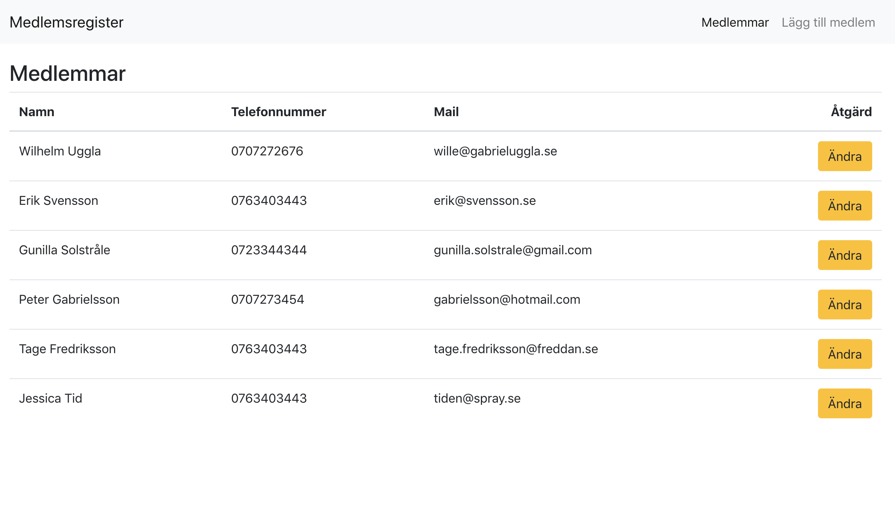

## Simple React CRUD application
View project [here](https://react-simple-crud.herokuapp.com/).

[localStorage](https://javascript.info/localstorage) is used to store the data. If you load the data for the first time some data is added automatically to showcase the application.

